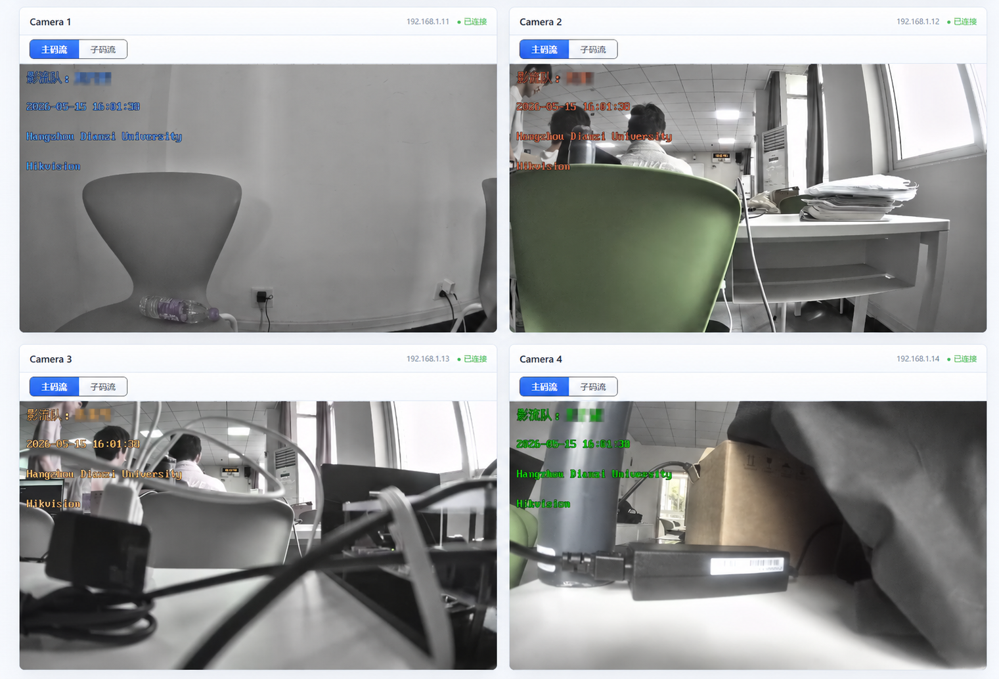
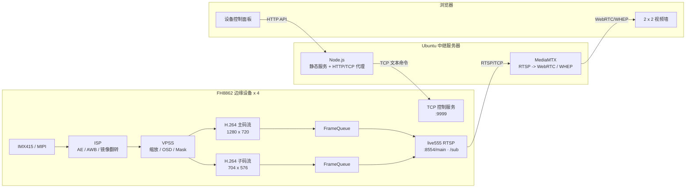
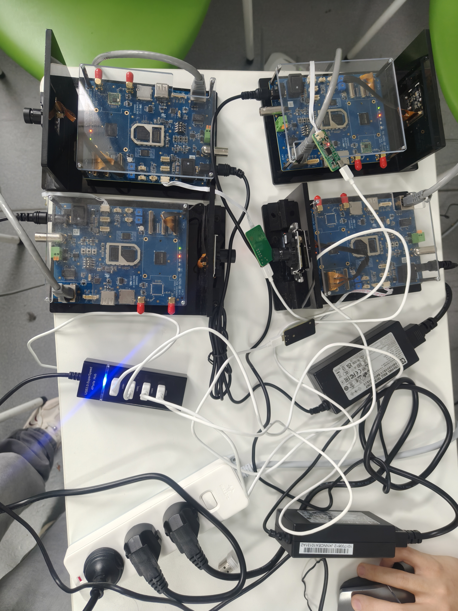
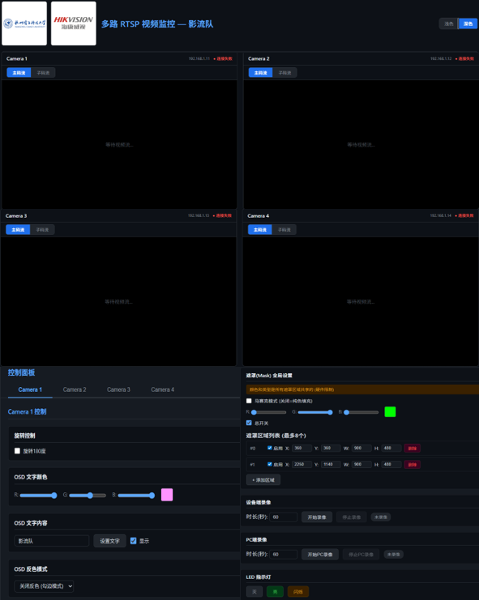
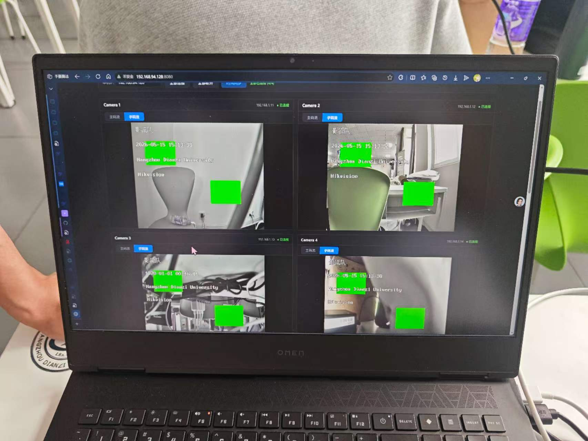
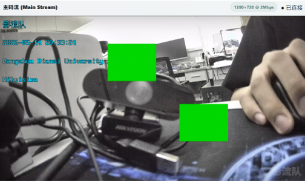

# FH8862 Multi-Channel Video Surveillance

> 基于 FH8862 ARM Cortex-A7 的四设备、双码流视频监控系统：板端完成 IMX415 采集、ISP/VPSS 处理、H.264 硬件编码与 live555 RTSP 发布，服务器侧通过 MediaMTX 转换为 WebRTC，并提供浏览器视频墙和远程设备控制。

<p align="center">
  
  
  
  
  
</p>

<p align="center">
  <a href="https://github.com/xingchennnnn"></a>
  <a href="mailto:25323666413@qq.com"></a>
</p>

<p align="center">
  
</p>

## 项目亮点

- **四设备集中监控**：4 块 FH8862 开发板独立推流，浏览器以 2 x 2 视频墙统一预览和控制。
- **双码流输出**：每块设备同时提供 1280 x 720 主码流和 704 x 576 子码流，可按通道动态切换。
- **采集与发送解耦**：编码线程将 Annex-B H.264 帧写入互斥锁保护的有界队列，live555 按需拉取，队列满时淘汰最旧帧以限制积压。
- **视频与控制分离**：RTSP/WebRTC 承载视频，HTTP -> TCP 独立控制链路负责 OSD、隐私遮罩、录像、LED、旋转和时间同步。
- **大帧稳定传输**：针对 720p I 帧超过 live555 缓冲区后出现截断、NALU 混叠和花屏的问题，实现分片交付并修正起始码处理。
- **端到端工程闭环**：覆盖传感器 Bring-up、ISP/VPSS、硬件编码、RTSP 服务、协议转换、Web 播放与多板联调。

### 面向嵌入式 C/C++/Linux 岗位的技术要点

| 能力维度 | 项目实践 |
| --- | --- |
| C/C++ 混合工程 | 媒体管线和硬件 SDK 使用 C 实现；live555 适配层使用 C++11，并通过 `extern "C"` API 向 C 主程序暴露稳定接口 |
| Linux 多线程 | 使用 pthread 管理编码取流、TCP 控制、LED 状态等任务；通过互斥锁和有界队列协调生产者/消费者 |
| Linux 网络编程 | 板端基于 Socket 实现 TCP 控制服务；服务器端按设备 IP 建立短连接，将 HTTP 请求转换为文本命令 |
| 资源与实时性 | 限制主/子码流队列容量，网络拥塞时淘汰旧帧，避免延迟持续增长和内存无界占用 |
| 设备与系统接口 | 使用 `ioctl` 控制 LED 字符设备，使用 `/proc`、GPIO 和厂商 MPI 接口完成媒体硬件配置 |
| 进程与时钟 | 使用 `clock_settime`/`settimeofday` 同步系统时间，以 `fork + exec` 调用 `hwclock`，避免多线程环境直接使用 `system()` |
| 交叉编译 | 使用 Makefile 管理 C/C++ 编译、ARM Cortex-A7/NEON 选项、section 化编译和静态库链接，目标工具链为 `arm-fullhanv3-linux-uclibcgnueabi-` |
| 分层调试 | 沿 Sensor/MIPI -> ISP -> VPSS -> VENC -> live555 -> RTP/WebRTC 链路逐层定位无帧、截断和花屏问题 |

## 系统架构



### 两条独立链路

| 链路 | 路径 | 设计目标 |
| --- | --- | --- |
| 视频链路 | IMX415 -> ISP -> VPSS -> H.264 -> FrameQueue -> live555 -> MediaMTX -> WebRTC | 低延迟传输、双码流、浏览器直接播放 |
| 控制链路 | Browser -> Node.js HTTP API -> TCP :9999 -> FH8862 | 按 `camera_id` 精确寻址，避免控制逻辑侵入视频协议 |

### 分层职责

| 层级 | 主要职责 | 关键实现 |
| --- | --- | --- |
| FH8862 板端 | 采集、图像处理、编码、RTSP 发布和设备控制 | C/C++、pthread、Socket、ioctl、live555、厂商 MPI |
| Ubuntu 中继端 | 汇聚 8 条 RTSP 路径并转换为浏览器可播放的 WebRTC | MediaMTX、WHEP、Node.js HTTP/TCP 代理 |
| 浏览器前端 | 2 x 2 视频墙、码流切换、控制表单和 PC 端录像 | HTML/CSS/JavaScript、WebRTC、MediaRecorder |

## 功能清单

| 模块 | 功能 |
| --- | --- |
| 视频采集 | IMX415 MIPI 输入，ISP 自动曝光、白平衡及镜像翻转 |
| 图像处理 | VPSS 缩放、OSD 叠加、纯色/马赛克隐私遮罩 |
| 编码推流 | H.264 硬件编码，主/子双码流，live555 RTSP 服务 |
| 多路预览 | 4 路并发 WebRTC 播放，单通道主/子码流切换 |
| OSD | 中英文文本、RGB 颜色、显示开关、按行反色 |
| 隐私遮罩 | 最多 8 个区域，支持区域增删、颜色及马赛克粒度设置 |
| 录像 | 板端定时录像控制、浏览器 MediaRecorder WebM 录像 |
| 设备控制 | 180 度旋转、LED 灭/亮/闪烁、四设备时间广播同步 |

## 关键参数

| 项目 | 主码流 | 子码流 |
| --- | --- | --- |
| 分辨率 | 1280 x 720 | 704 x 576 |
| 帧率 | 25 FPS | 25 FPS |
| 目标码率 | 约 2 Mbps | 约 700 Kbps |
| RTSP 路径 | `/main` | `/sub` |
| FrameQueue 容量 | 50 帧，约 2 秒 | 30 帧，约 1.2 秒 |

> 默认 4 路全部使用子码流时，视频净码率约为 2.8 Mbps；实际带宽还需计入 RTP、RTSP、WebRTC 等协议开销。

## 网络拓扑

默认实验网络使用以下静态地址，可在 [`web/server.js`](web/server.js) 和 [`web/mediamtx.yml`](web/mediamtx.yml) 中修改：

| 设备 | 地址 | 服务 |
| --- | --- | --- |
| Ubuntu 中继服务器 | `192.168.1.1` | Web `:8080` / WebRTC `:8889` / MediaMTX API `:9997` |
| Camera 1 | `192.168.1.11` | RTSP `:8554` / Control `:9999` |
| Camera 2 | `192.168.1.12` | RTSP `:8554` / Control `:9999` |
| Camera 3 | `192.168.1.13` | RTSP `:8554` / Control `:9999` |
| Camera 4 | `192.168.1.14` | RTSP `:8554` / Control `:9999` |

每块板提供两个 RTSP 地址：

```text
rtsp://<board-ip>:8554/main
rtsp://<board-ip>:8554/sub
```

## 快速开始

### 1. 准备环境

板端：

- FH8862 开发板与 IMX415 传感器
- `arm-fullhanv3-linux-uclibcgnueabi-` 交叉编译工具链
- 与目标固件匹配的 FH8862 SDK 头文件、库、驱动和 ISP 参数
- 为 ARM 目标编译的 live555 静态库

Ubuntu 中继端：

- Node.js 16+ 与 npm
- MediaMTX v1.11.3
- `bash`、`wget`、`tar`、`lsof`
- 与 4 块板处于同一局域网

由于厂商 SDK 和预编译二进制可能受其许可协议约束，本仓库不分发这些文件。请从合法渠道取得后按下面的路径放置：

```text
include/                   # FH8862 SDK headers
lib/static/                # FH8862 static libraries
lib/live555/               # ARM live555 headers and static libraries
driver/                    # 与目标内核匹配的模块与固件
lib/imx415_mipi_attr.hex   # 对应传感器的 ISP 参数
```

### 2. 交叉编译板端程序

```bash
make clean
make -j$(nproc)
```

成功后生成 ARM 可执行文件 `demo`。如使用仓库中的部署脚本，请先根据本机 NFS 目录修改 [`make.sh`](make.sh)。

### 3. 部署到开发板

以下以 Camera 2 为例：

```bash
ifconfig eth0 192.168.1.12
mount -t nfs 192.168.1.1:/mnt/nfs_share /mnt -o nolock

cd /mnt/driver
sh load_modules_FH8862.sh

cp /mnt/imx415_mipi_attr.hex /home/
cd /mnt
./demo
```

启动后可先使用 VLC 或 ffplay 验证：

```bash
ffplay -rtsp_transport tcp rtsp://192.168.1.12:8554/main
ffplay -rtsp_transport tcp rtsp://192.168.1.12:8554/sub
```

> 常规 RTSP/Web 预览直接执行 `./demo`。带目标 IP 参数会额外启用遗留 PES/UDP 通路，不建议在常规运行中使用。

### 4. 启动中继与 Web 服务

```bash
cd web
npm install
./start.sh
```

`start.sh` 会在缺少 MediaMTX 时下载 v1.11.3，并依次启动 MediaMTX 与 Node.js 服务。访问：

```text
http://192.168.1.1:8080
```

停止服务：

```bash
cd web
./stop.sh
```

更完整的四板部署步骤和排查命令见 [`md/运行指令.md`](md/运行指令.md)。

## 控制协议

前端请求均携带 `camera_id`，Node.js 根据设备表转发到目标板的 TCP `9999` 端口。

```bash
curl -X POST http://192.168.1.1:8080/api/rotate \
  -H 'Content-Type: application/json' \
  -d '{"camera_id":2,"rotate":true}'
```

典型 API：

| HTTP API | 板端命令 | 说明 |
| --- | --- | --- |
| `POST /api/rotate` | `ROTATE` | 画面旋转 180 度 |
| `POST /api/osd/text` | `OSD_TEXT_HEX` | GB2312 OSD 文本 |
| `POST /api/osd/color` | `OSD_COLOR` | OSD RGB 颜色 |
| `POST /api/mask/region/set` | `MASK_REGION_SET` | 新增或更新遮罩区域 |
| `POST /api/mask/type` | `MASK_TYPE` | 纯色/马赛克模式 |
| `POST /api/record/start` | `RECORD_START` | 启动设备端定时录像 |
| `POST /api/led` | `LED` | LED 灭/亮/闪烁 |
| `POST /api/time/sync` | `TIME_SYNC` | 向全部设备广播时间 |

控制数据流：

```text
Browser                Node.js                    FH8862 board
   |                       |                           |
   | POST /api/rotate      |                           |
   | {camera_id: 2, ...}   |                           |
   |---------------------->|                           |
   |                       | TCP "ROTATE 1\n"         |
   |                       |-------------------------->|
   |                       |<------------------- "OK" |
   |<------ {ok: true} ----|                           |
```

## 核心实现

### H.264 帧接入 live555

编码线程从 `FH_VENC_GetStream_Block()` 取得 NALU 列表，组装为完整 Annex-B 帧后调用 `rtsp_live555_push_frame()`。主、子码流分别进入独立 `FrameQueue`，live555 的 `FramedSource` 再以 pull 模型消费。

```text
Hardware VENC -> Annex-B frame -> FrameQueue -> H264LiveSource
              -> H264VideoStreamFramer -> H264VideoRTPSink
```

队列具备三个约束：

1. `pthread_mutex` 保护生产者和消费者并发访问。
2. 队列满时释放并淘汰最旧帧，防止网络变慢导致内存无界增长。
3. 队列空时通过 live555 调度器延迟 10 ms 重试，不阻塞事件循环。

### 多设备控制路由

浏览器只面向统一的 HTTP API；[`web/server.js`](web/server.js) 将 `camera_id` 映射为目标板 IP，再建立短连接发送一行文本命令。视频故障不会阻塞控制命令，控制逻辑也不依赖 RTSP 会话状态。

### Web 前端的定位

前端不是独立的视频处理服务，而是嵌入式设备的可视化控制面：

- [`web/js/webrtc-player.js`](web/js/webrtc-player.js) 根据 `cam{n}_main` / `cam{n}_sub` 组装 WHEP 地址，为每个窗口维护独立的 `RTCPeerConnection`。
- 主/子码流切换只重建目标窗口的 WebRTC 会话，不影响其他设备。
- 控制面板统一调用 `/api/*`，由 Node.js 完成设备寻址和 UTF-8 -> GB2312 转换，板端保持轻量文本协议。
- PC 端录像直接复用浏览器收到的 `MediaStream`，通过 `MediaRecorder` 生成 WebM；设备端录像则通过 TCP 命令进入板端媒体通路。
- 页面同时展示设备连接状态、码流类型和控制结果，便于多板联调时区分视频链路与控制链路故障。

## 关键问题与修复

| 问题 | 根因 | 处理 |
| --- | --- | --- |
| VLC 可连接但无画面 | Sensor 复位后 MIPI PLL 尚未稳定，ISP 提前启动 | `isp_server_run()` 前增加 500 ms 稳定等待 |
| 720p 主码流花屏 | 大 I 帧超过 live555 内部缓冲后被截断，新旧帧数据混叠 | `H264LiveSource` 保存剩余数据并分片交付 |
| 主码流 FU-A 分片异常 | Framer 输出包含 Annex-B 起始码，RTP Sink 将 `0x00` 误作 NALU header | 设置 `includeStartCodeInOutput=False` |
| 网络消费变慢后帧积压 | 编码生产与网络发送速率不一致 | 使用有界队列并执行旧帧淘汰 |
| 中文 OSD 乱码 | 板端字库接口使用 GB2312，浏览器发送 UTF-8 | Node.js 使用 `iconv-lite` 转码并以十六进制命令传输 |

详细调试过程见 [`md/DEBUG.md`](md/DEBUG.md)。

## 目录结构

```text
.
├── src/
│   ├── main.c                  # 媒体管线、编码取流、OSD/Mask/LED 状态
│   ├── control_server.c        # TCP 控制服务与命令解析
│   ├── rtsp_live555.cpp        # RTSP Server 与主/子码流会话
│   ├── frame_queue.cpp         # 线程安全有界帧队列
│   ├── h264_live_source.cpp    # live555 FramedSource 适配与大帧交付
│   ├── h264_subsession.cpp     # H.264 OnDemand 子会话
│   ├── isp.c / sensor.c        # ISP 与传感器适配
│   └── libdmc*.c / libpes.c    # DMC、录像和遗留 PES 通路
├── inc/                        # 项目内部头文件
├── web/
│   ├── index.html              # 四路视频墙与控制台
│   ├── js/webrtc-player.js     # WHEP 播放、控制与浏览器录像
│   ├── server.js               # HTTP 静态服务与 TCP 控制代理
│   ├── mediamtx.yml            # 4 设备 x 2 码流转发配置
│   └── start.sh / stop.sh      # 中继服务启停脚本
├── image/                      # 系统截图与联调照片
├── md/                         # 运行、设计和调试文档
├── Makefile                    # FH8862 交叉编译配置
└── make.sh                     # 本地 NFS 部署辅助脚本
```

## 运行效果

| 四机位联调 | 浏览器控制台 |
| --- | --- |
|  |  |

| 多路视频墙 | 单机位验证 |
| --- | --- |
|  |  |

## 已知限制

- 板端构建依赖特定版本的 FH8862 SDK、交叉编译器、内核模块和传感器参数，无法在普通 x86 主机上直接完成全量编译验证。
- 当前设备地址在 MediaMTX 和 Node.js 配置中静态声明，切换网段时需同步修改。
- RTSP 服务当前只接入 H.264；源码中的 H.265 分支未接入 live555 会话。
- FrameQueue 仍对每帧执行内存申请与释放；长时间运行场景可进一步改为预分配内存池或环形缓冲区。
- 控制接口面向可信局域网设计，默认未启用鉴权和 TLS，请勿直接暴露到公网。

## 第三方组件与许可说明

- [live555](https://www.live555.com/liveMedia/)：RTSP/RTP 服务框架，请遵循其上游许可。
- [MediaMTX](https://github.com/bluenviron/mediamtx)：RTSP 到 WebRTC/WHEP 转换，采用 MIT License。
- [iconv-lite](https://github.com/ashtuchkin/iconv-lite)：Node.js 字符编码转换。
- FH8862 SDK、驱动、传感器参数和预编译库归各自权利人所有，不包含在公开仓库中。

本仓库用于个人技术作品展示与嵌入式音视频工程交流。除有明确上游许可证的第三方文件外，未另行授予复制或商用许可。

## 文档索引

- [完整运行指令](md/运行指令.md)
- [多摄像头多链路方案](md/多摄像头多链路方案书.md)
- [问题定位与调试记录](md/DEBUG.md)
- [设计展示说明](md/创新设计PPT.md)

## 作者

- GitHub：[@xingchennnnn](https://github.com/xingchennnnn)
- Email：[25323666413@qq.com](mailto:25323666413@qq.com)
